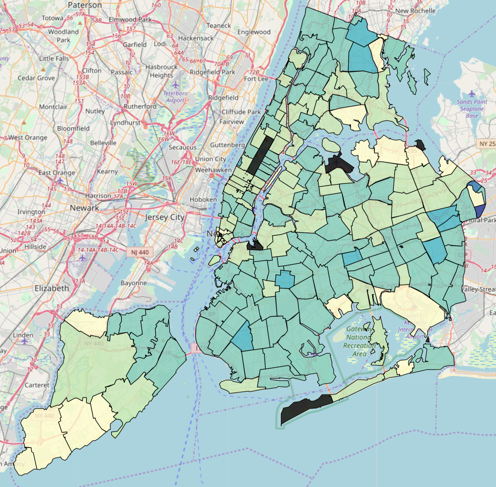
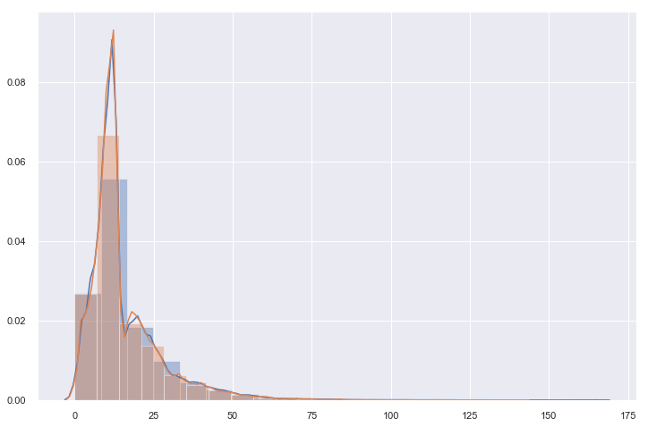
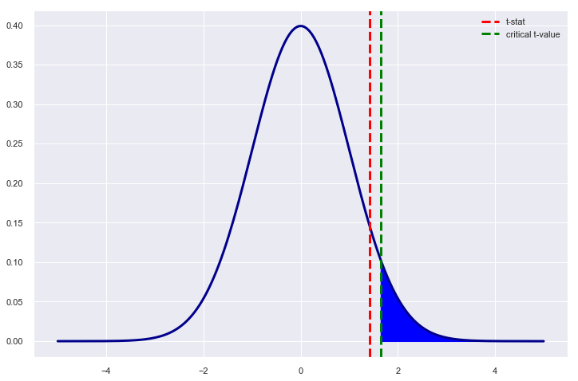
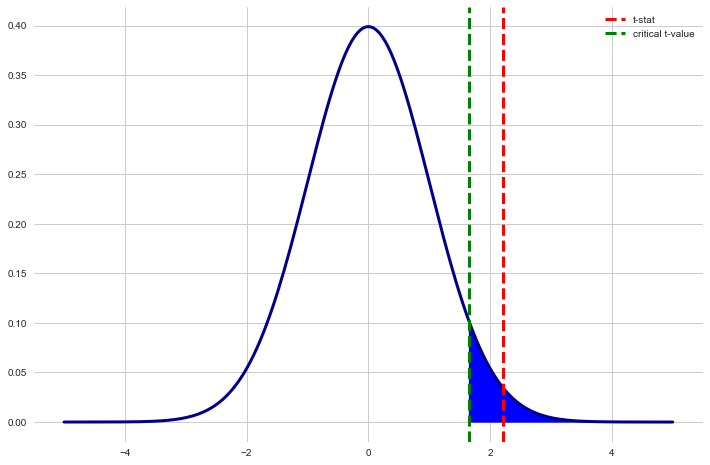

# Files:
The main work is done in the **Project 3 - Readme and Results.ipynb**, which calls functions in the following python files:
- get_weather.py
- day_of_week.py
- rests_vs_violations.py
- rodents.py

The .py files reference the following .csv files, so live data is not necessary:
- merge_2.csv
- df_rat_complaints_by_zipcode.csv
- violations_per_zip.csv

There is an html map available [here](violations_per_insp_map.html) that can be downloaded locally and run. It is otherwise screenshotted in the repository.

# The Data:

Sources:
- **DOHMH New York City Restaurant Inspection Results**
    - From 2017-06-01 through 2019-06-05
    - 268,458 health code violations
    - 84,576 inspections
    - 20,697 retaurants
    - https://data.cityofnewyork.us/Health/DOHMH-New-York-City-Restaurant-Inspection-Results/43nn-pn8j
- **Dark Sky API**
    - Weather data for the 641 dates where inspections occured during those two years
    - https://darksky.net/dev
- **311 Service Requests from 2010 to Present**
    - Used API to receive 254,171 rodent-related complaints
    - https://data.cityofnewyork.us/Social-Services/311-Service-Requests-from-2010-to-Present/erm2-nwe9
    - https://dev.socrata.com/foundry/data.cityofnewyork.us/fhrw-4uyv
    
## Hypothesis 1: The more locations of a restaurant, the lower the code violation score

## Result of testing Hypothesis 1
The p-value **with** Pret A Manger, which seems like an outlier, is 0.016. With it removed from the dataset, the p-value is 0.010. Both are below 0.05, which would allow us to reject the null hypothesis.

    
## Hypothesis 2: The more rodent complaints in a zipcode, the higher the rodent violations in an inspection in that zipcode

                                OLS Regression Results                            
    ==============================================================================
    Dep. Variable:           vio_per_insp   R-squared:                       0.116
    Model:                            OLS   Adj. R-squared:                  0.112
    Method:                 Least Squares   F-statistic:                     24.12
    Date:                Mon, 10 Jun 2019   Prob (F-statistic):           2.00e-06
    Time:                        16:09:12   Log-Likelihood:                 178.92
    No. Observations:                 185   AIC:                            -353.8
    Df Residuals:                     183   BIC:                            -347.4
    Df Model:                           1                                         
    Covariance Type:            nonrobust                                         
    ==============================================================================
                     coef    std err          t      P>|t|      [0.025      0.975]
    ------------------------------------------------------------------------------
    Intercept      0.2239      0.010     21.520      0.000       0.203       0.244
    complaints     0.0001    2.5e-05      4.911      0.000    7.34e-05       0.000
    ==============================================================================
    Omnibus:                       45.235   Durbin-Watson:                   1.629
    Prob(Omnibus):                  0.000   Jarque-Bera (JB):              175.696
    Skew:                           0.874   Prob(JB):                     7.05e-39
    Kurtosis:                       7.443   Cond. No.                         637.
    ==============================================================================

    Warnings:
    [1] Standard Errors assume that the covariance matrix of the errors is correctly specified.

## Hypothesis 3:  Bad weather leads to more infractions during a restaurant inspections in NYC

The mean score on days with precipitation is  15.6
With a standard deviation of  11.977
The mean score on days without precipitation is  15.48
With a standard deviation of  11.66
The t-stat is 1.414 and the the p value is 0.157.

    Distribution of Inspections Scores on Preciptation and Non-Precipitation Days

### Result of testing Hypothesis 3

The critical value of 1.6449 is larger than the t-statistic of 1.414, with a p-value of 0.157. Therefore we fail to reject the null hypothesis.

## Hypothesis 4: NYC resaurants are more likely to get to be cited for a greater number of infractions at the beginning of the week

The mean inspection score for Monday's and Tuesday's is  15.564
With a standard deviation of  11.671
The mean inspection score for Thursday's and Friday's is  15.356
With a standard deviation of  11.794
The t-stat is 2.213 and the the p value is 0.0269.

### Result of testing hypothesis 4:
The critical value of 1.6449 is less than the t-statistic of 2.2132753769214997, with a p-value of 0.026882281413865797. Therefore we are able to reject the null hypothesis.
